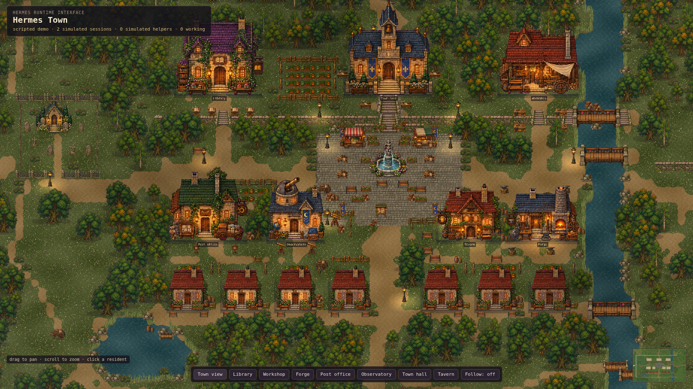

# Hermes Town

A local pixel-art interface for Hermes Agent. Every resident represents a real Hermes execution context. Tool calls send residents to the library, workshop, forge, post office, observatory, or town hall. Completed sessions rest at the tavern and eventually walk home.



> Developer preview. The native Hermes bridge works, but installation is intentionally explicit while the one-package installer is being built.

## Requirements

- [Hermes Agent](https://github.com/NousResearch/hermes-agent) 0.21.2, the validated preview baseline
- Node.js `^20.19.0` or `>=22.12.0`
- npm

## Try the demo

The demo uses scripted browser events and does not connect to Hermes.

```bash
git clone https://github.com/sxuff/hermes-town.git
cd hermes-town
npm ci
npm run dev
```

Open `http://127.0.0.1:5173/?agents=demo&hour=17`.

## Connect a local Hermes runtime

The installer copies the passive bridge plugin into the selected Hermes home and creates a local token. It does not enable the plugin, edit configuration, restart Hermes, or start the server.

```bash
npm ci
npm run build
npm run install:plugin
hermes plugins doctor ~/.hermes/plugins/hermes-town --ci
hermes plugins enable hermes-town
npm run serve:live
```

Restart the Hermes process you want to observe:

```bash
hermes gateway restart
# Or start a new Hermes CLI session.
```

Open `http://127.0.0.1:4187/` and run a real turn. The default page is live mode. Use `?agents=demo` for the scripted demo.

For a non-default profile or Hermes home:

```bash
node scripts/install-hermes-town-plugin.mjs --hermes-home /path/to/hermes-home
```

## Privacy model

The plugin publishes only:

- a pseudonymous resident key derived with HMAC
- one of six role classes
- one of seven lifecycle kinds
- a sanitized tool name when a tool starts
- one of four outcome classifications

Prompts, messages, tool arguments, commands, paths, tool output, assistant responses, child goals, summaries, raw errors, raw runtime identifiers, and credentials have no field in the wire contract. The plugin and server both enforce allowlists.

The live server is for same-host use. It binds to `127.0.0.1`, sends no CORS headers, and serves an authenticated ingest endpoint plus read-only snapshot, SSE, and health routes. Do not expose a live town publicly. If you want a public showcase, use demo mode with no Hermes connection.

See [LIVE_BRIDGE.md](LIVE_BRIDGE.md) for the full contract and runbook.

## Controls

- Drag to pan.
- Scroll to zoom.
- Click a resident to inspect it.
- Use the bottom buttons to focus a building.
- Toggle Follow to track the selected resident.
- Click the minimap to jump.

## Project layout

```text
src/art/        Sprite import, terrain, structures, and character poses
src/assets/     Original runtime sprite atlases
src/world/      Authored town, countryside, collision, and pathfinding
src/sim/        Resident state, intents, stations, and tool-to-place mapping
src/live/       Live SSE and scripted demo sources
src/scenes/     Phaser rendering, camera, lighting, and particles
server/         Same-host static, snapshot, SSE, and ingest server
integrations/   Passive native Hermes bridge plugin
scripts/        Installation and browser verification
```

## Verification

```bash
npm ci
npm run test:contracts
npm run build
npx playwright install chromium
npm run verify:world
hermes plugins doctor integrations/hermes-town-plugin --ci
```

`test:contracts` checks the plugin privacy allowlist and the real HTTP server contract. `verify:world` exercises navigation, resident lifecycle behavior, camera controls, offline-live honesty, and visual captures in Chromium.

## License

Hermes Town, including the code and shipped original assets, is licensed under the [MIT License](LICENSE).
